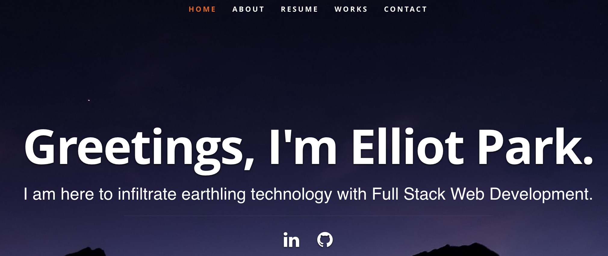

# React-Portfolio

A professional portfolio built with React

 

## Photo of Application

 

## Links

[Deployed App on Heroku]()

 

[Github Repository](https://github.com/elliotpark410/React-Portfolio)

 

## Table of Contents
  * [Getting Started](#getting-started)
  * [Installation](#installation)
  * [License and Acknowledgements](#license-and-acknowledgements)
  * [Contact](#Contact)

 

## Getting Started

To begin the application, use the following in command line:

`
npm run start 
`

 

## Installation

To run this application, you will need Node and other dependencies: 

1. You will need to install Node.js. Here is a link below:

[Download Node](https://nodejs.org/en/download/)

 

2. Once you have downloaded Node.js, you will want to download node package manager (npm). In command line, you can enter:

`npm install -g npm
`

 

3. Next, clone the repository and install all the dependencies in the package.json. In command line, you can enter:

`npm install 
`

 

## License and Acknowledgements

This project is licensed under the MIT license

 

## Contact
If you'd like to learn more about my projects, check out my Github profile: [https://github.com/elliotpark410](https://github.com/elliotpark410)

 

If you have any questions, please don't hesitate to email me at [elliotpark410@gmail.com](mailto:elliotpark410@gmail.com)

 
Copyright (c) 2022 Elliot Park

 
  

 

 

